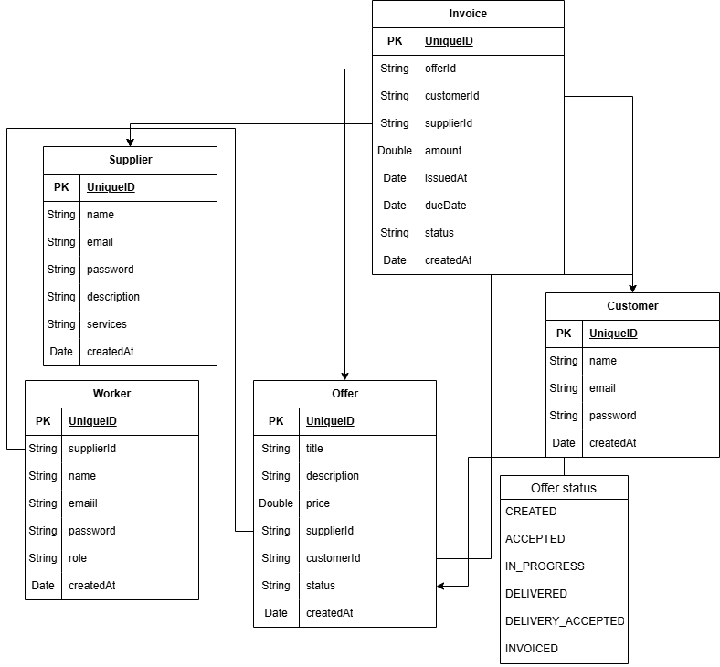

## Spring Boot Web 1

**This project is a backend Spring Boot application for managing IT service offers.**
**The system uses a REST API that allows customers and suppliers to manage offers**

### Overview
1. Supplier creates an offer.
2. Customer must accept the offer before work can begin.
3. Supplier starts work.
4. Supplier delivers the work.
5. Customer accepts the delivery.
6. Supplier invoices the offer.

